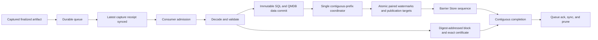

# Indexer Durable Queue

| Item | State |
| --- | --- |
| Design | Locked |
| Commonware prerequisite | Complete in `michael/qmdb-finalized-handoff` |
| Exoware prerequisite | Complete in `michael/prepare-authenticated-range` at `93dd027` |
| Constantinople implementation | Integrated and locally validated in `michael/indexer-durable-queue-redesign` |
| Deployment | Fresh queue partition and fresh remote namespaces |
| Dependency mode | Pinned Commonware and Exoware revisions |
| Final simplification pass | Complete with fixed-point review and full local validation |
| Production-shaped acceptance | Pending |
| Dependency completion | Pending until Explorer sibling dependencies are immutably pinned and clean-install validation is complete |

This document is the live implementation tracker and source of truth for the
durable queue. The architecture is settled. Items marked as remaining work are
implementation, validation, rollout, or documentation tasks.

## Locked outcome

The redesign uses a fresh durable queue partition. It stores self-contained
finalized block work with exact authenticated state and transaction ranges.
There is no legacy migration, dual reader, queue conversion, writer-state
conversion, or remote namespace continuation.

The local queue and one durable latest-capture receipt are the only publisher
restart authorities. Remote QMDB writer state and remote watermark recovery are
removed. Remote writes are immutable and safe to repeat. A same-key,
different-value result is corruption, an encoder mismatch, or evidence of a
second writer.

Commonware captures the exact winning artifacts before database apply and
delivers them after successful application. Blocks reflected through recovery
or state sync without applying their individual batches invoke neither hook.
Constantinople does not reconstruct finalized operations from database history
and does not treat Simplex observer correlation as authoritative.

Immutable data commits may finish out of order. One coordinator owns
publication. It advances only through the complete contiguous queue prefix by
atomically writing both QMDB watermarks and every covered height-to-digest
publication target.

## Prerequisite status

### Commonware

Implementation is complete in `michael/qmdb-finalized-handoff` at
`a44a32bf6e5b2f48791b874354dbd47fe3731174`.

- `Application::capture_finalized` receives the exact winning merkleized
  batches and pre-apply readers.
- The processor captures the artifact before `DatabaseSet::apply` consumes the
  batches.
- `Application::finalized` receives the owned artifact and post-apply readers
  after successful application.
- Both hooks run only for winning batches applied by the stateful actor, in
  application order.
- Compact keyless batches retain and hand off the exact operations that formed
  the root, the range proof, and pinned prefix nodes.

Validation completed for the current working tree.

- The combined Commonware storage and glue run passed 3,368 tests. The default
  profile skipped 471 tests.
- Focused cached winner, reconstructed winner, duplicate finalization, and
  startup synchronization tests passed.
- Focused compact keyless finalized-artifact tests passed for MMR and MMB.
- Glue and storage Clippy checks passed with warnings denied.
- Glue documentation, stability, formatting, and assigned-file diff checks
  passed.
- Independent review found no actionable defect in the final Commonware diff.

Both Exoware and Constantinople pin this Commonware revision.

### Exoware

Implementation is complete in `michael/prepare-authenticated-range` at
`93dd027`.

- Stateless authenticated-range preparation remains generic across ordered,
  unordered, immutable, and keyless QMDB variants.
- The borrowed API accepts a start, exact operation bytes, proof, pins, and a
  caller-trusted root. The proof leaf count supplies the exclusive end.
- Validation binds the artifact to the trusted root, checks proof and pins,
  rejects noncanonical operation encodings, enforces terminal commit rules,
  and reconstructs the expected Merkle result.
- Preparation validates exact operation bytes in operation rows and emits
  deterministic absolute logical rows. Authenticated prefix pins are emitted
  as node rows so a nonzero suffix is independently readable in an empty
  namespace.
- Staging consumes the prepared rows and returns an opaque publication
  capability. The capability carries the exact presence row and watermark
  derived from the verified range. A caller cannot publish an arbitrary raw
  location.
- Store write batches split deterministically by physical row count and
  materialized byte size before upload.
- Preparation does not allocate dispatch identifiers, inspect pending
  acknowledgements, recover a writer, or choose a publication frontier.

Independent fixed-point review found no actionable defect in the current
implementation. The branch includes MMR and MMB authenticated-range coverage,
established builder parity checks, tamper rejection, namespaced staging
coverage, and delayed subscription publication coverage. Operation-only Store
frames remain pending until covering presence and watermark rows arrive. They
are released in Store sequence order with a proof read floor that includes the
publication barrier. The full QMDB suite and strict all-target QMDB Clippy pass
against the local Commonware dependency.

### Constantinople

Core integration is complete in `michael/indexer-durable-queue-redesign`.

Production-shaped acceptance is pending. The local validation evidence below does
not establish production-shaped backlog behavior or deployment readiness.

The uncommitted working tree contains the following pieces.

- Application integration captures state and compact transaction artifacts
  through the new Commonware two-stage finalized handoff.
- A queue payload records the frozen identities, full block, exact
  finalization, timestamp, and both authenticated ranges.
- Queue reads retain raw bytes until byte admission allows structured decode.
- A stateless publisher prepares SQL and both QMDB ranges, allows per-entry data
  commits to finish out of order, and publishes a contiguous prefix through one
  coordinator.
- Data rows are committed in deterministic chunks capped at 100,000 physical
  rows and 32 MiB of materialized Store data. Presence rows remain private
  until the final publication barrier.
- The barrier batch contains the paired QMDB watermarks and height-to-digest
  publication targets.
- A durable latest-capture receipt and post-receipt consumer admission gate are
  integrated in the validator.
- Validator configuration rejects an indexer combined with `StateSync` before
  runtime work starts.
- The queue consumer uploads the digest-addressed block and exact archived
  finalization as one required completion gate.
- Recovery validates queue positions, heights, digests, and adjacent range
  continuity before admission. It repairs a receipt behind the queue tail and
  rejects a receipt ahead of a nonempty queue.
- Consumer completion, acknowledgement, sync, and pruning advance only across
  the fully complete contiguous queue prefix.
- The Rust indexer client exposes publication targets with the Store sequence
  at which they were observed.
- Typed Rust transaction reads use an unseeded `tx_meta.height` only as a hint.
  They require the exact publication target and reread the canonical `tx_meta`
  row through a DataFusion context seeded at the target Store sequence.
- The canonical `tx_meta` row contains digest, height, QMDB location, and body.
  There is no `tx_proof_meta` sidecar or legacy fallback.
- Explorer target subscription and read-floor integration covers block,
  transaction, account, Simplex, SQL, and both QMDB read paths.
- Durable queue codecs are available only for SHA-256, matching the frozen
  hasher identity written into every queue frame.

The branch pins Commonware and Exoware to immutable revisions. Full workspace
tests, lint, build, explorer tests, and the explorer production build pass. The
final three-repository review found no remaining actionable defect.

Validation completed for the integrated local trees.

- Constantinople `just test` passed all 300 selected tests. Two tests were
  skipped by the configured nextest profile.
- Constantinople `just lint`, `just fmt-check`, and `just build` passed.
- Explorer tests passed all 71 tests and the Vite production build completed.
- Exoware QMDB, SDK, and SQL Rust suites and strict all-target Clippy passed.
  The Exoware SDK passed all 64 TypeScript tests, TypeScript lint, and its
  production build.
- Commonware storage and glue tests, strict Clippy, documentation, stability,
  and formatting checks passed as recorded above.

## Queue item contract

Every item is self-contained. It stores all data needed to regenerate the same
SQL and QMDB writes after a restart or binary upgrade.

| Field | Required meaning |
| --- | --- |
| Queue magic and format version | Select the queue decoder |
| Row layout version | Select the Exoware logical row layout |
| Metadata encoder version | Select the only SQL encoder allowed for replay |
| Hasher identity | Select the digest and leaf hashing rules |
| Merkle family identity | Select proof, pin, and node layout rules |
| State QMDB kind | Identify the unordered state artifact |
| Transaction QMDB kind | Identify the keyless transaction artifact |
| State operation codec | Decode and re-encode exact state operation bytes |
| Transaction operation codec | Decode and re-encode exact transaction operation bytes |
| Full block | Supply the digest-addressed block and canonical metadata inputs |
| Exact finalization certificate | Prove finality for this exact block commitment |
| Finalized timestamp | Reproduce timestamped metadata |
| State authenticated range | Supply exact operations, proof, pins, start, and end |
| Transaction authenticated range | Supply exact operations, proof, pins, start, and end |

Each range uses half-open bounds `[start, end)`. The final inclusive QMDB
location is `end - 1`. The proof targets `end` leaves. The number of encoded
operations equals `end - start`.

The encoded operation bytes are canonical queue data. Validation may decode
them to enforce QMDB-specific rules, but re-encoding must produce the same
bytes. Leaf hashing, operation rows, proof verification, and replay all use the
queued bytes.

The item stores canonical metadata inputs rather than duplicating every SQL
row. Replay must select the item's `metadata_encoder_version`. An unsupported
version fails before staging any write. Replay never falls back to the newest
encoder in the running binary.

## Finalized capture and producer ordering

The producer follows one ordered path.

1. Commonware calls `capture_finalized` with the exact winning batches and
   pre-apply readers.
2. Constantinople takes ownership of both operation vectors, proofs, and pins.
3. Commonware applies the winning batches.
4. Commonware delivers the captured artifact and post-apply readers.
5. Constantinople obtains the exact height finalization certificate from the
   durable marshal archive and verifies that its payload commits to the block.
6. Under the producer lock, Constantinople checks the next block height and
   requires both range starts to equal the previous receipt's ends.
7. The producer durably enqueues the complete queue item.
8. The producer writes and syncs one atomic latest-capture receipt containing
   height, block digest, state end, and transaction end.
9. Only after receipt sync does the producer open that queue position to
   consumer admission.
10. The finalized hook returns only after the durable capture boundary is
    complete.

The latest-capture receipt is minimal producer deduplication state. It is not a
remote writer cursor, an upload completion marker, or publication authority.
It remains durable after older queue items are acknowledged and pruned.

Blocks reflected through startup recovery, duplicate delivery, or state sync
without applying their individual batches invoke neither hook. Genesis also
invokes neither hook. The first captured batch is height one. A crash after a
hook completes but before the node durably records the application may cause
that batch to be applied and delivered again. A redelivery within the durable
captured prefix completes without another enqueue.

Indexer-enabled peer state sync is unsupported. Startup rejects any
configuration that combines the indexer with `StateSync`. An indexing node
must process every finalized block from genesis so it can capture each exact
authenticated range.

## Artifact validation

The producer validates enough structure to reject an impossible queue item.
The consumer validates the admitted encoded item again before staging Store
writes.

For both QMDB ranges, validation must establish the following facts.

1. Every frozen format and encoder identity is supported.
2. `start < end` and all range arithmetic is checked.
3. `start + encoded_operations.len() == end`.
4. The proof leaf count equals `end`.
5. The capture-time artifact root equals the finalized block header root.
6. The queued end equals the corresponding finalized block header end.
7. The exact operation bytes, proof, and pins authenticate the header root.
8. Extending the pinned frontier with the operations produces the expected size
   and root.
9. Every operation is canonically encoded for the frozen operation codec.
10. The state range contains exactly one terminal `CommitFloor` with a valid
    floor.
11. The transaction range contains exactly one terminal `Commit`.
12. The QMDB kind and namespace assignment match the state or transaction role.
13. The exact finalization certificate commits to the queued block digest.

The block header start is the inactivity-floor boundary. It is not the exact
operation-batch start and is not used for queue continuity. The authenticated
range start comes from the captured winning batch. The producer and recovery
paths require that exact start to equal the prior durable range end.

A deterministic validation failure is corruption or an unsupported binary. It
fails the supervised indexer and leaves the item unacknowledged.

## Stateless Exoware preparation

The consumer passes each validated range to the frozen Exoware preparation
path. Preparation has no mutable continuation input.

- It receives the caller-trusted header root.
- It verifies bounds, exact bytes, proof, pins, terminal operation, inactivity
  state, computed size, and computed root.
- It reconstructs Merkle state from the authenticated pinned prefix.
- It emits deterministic absolute logical rows and authenticated prefix nodes.
- It verifies that operation rows contain the queue-carried canonical bytes.
- It returns staged data rows and an opaque publication capability derived
  from the verified final location.
- Sequential and parallel hashing must produce byte-identical rows.
- Public staging applies the configured namespace prefix.
- Publication staging emits the verified presence row and exact watermark.

The publication path never constructs or recovers Exoware `WriterState`. It
never reads a remote watermark to choose a start, skip a queue item, or rebuild
a Merkle frontier.

## Persistence and contiguous publication

After queue-order admission, each item may prepare and commit its immutable SQL
and QMDB data independently. A later item's data commit may finish first. Its
rows remain unpublished while an earlier item is incomplete.

One logical data batch is split in physical staging order. Each Store request
contains at most 100,000 rows and at most 32 MiB under Store's materialized
entry accounting. Chunks commit sequentially for one item. A deterministic
entry-size violation fails before the first request rather than retrying an
unchanged rejected request. QMDB presence rows are held for the publication
barrier, so no intermediate chunk advertises an incomplete range.

Only one coordinator may publish for the two QMDB namespaces. It tracks queue
order, height, block digest, both range bounds, and immutable data durability.
It stops at the first missing or incomplete item.

For the largest newly complete prefix, the coordinator creates one atomic
Store batch containing all of the following rows.

- The state QMDB watermark at the last item's `state.end - 1`.
- The transaction QMDB watermark at the last item's
  `transactions.end - 1`.
- The state and transaction presence rows paired with those watermarks.
- One height-to-digest publication target for every newly covered block.

Both QMDB watermarks and all covered publication targets become visible at one
Store sequence. Intermediate watermark rows are unnecessary because each
watermark authorizes the complete contiguous prefix through its inclusive
location.

A failed or ambiguous barrier commit repeats the same keys and values. Older
watermark rows remain in Store. Readers select the greatest published
watermark, so replaying an older pair cannot lower the visible prefix.

## Downstream consistency

The Store sequence returned by the barrier commit is the downstream
lower-bound consistency token. It means that a read evaluated at or after that
sequence can observe the paired watermarks and publication targets from the
barrier.

The sequence is not an upper-bounded snapshot. Separate services or sessions
may observe later data. Correct clients still bind the requested height to its
published digest, obtain roots and ends from the certified block, request both
QMDB proofs at those ends, and verify the proofs. Missing rows and a
watermark-too-low response are retryable catch-up states.

QMDB readers authorize only the contiguous prefix at or below their published
watermark. Data rows above the watermark are private staged data. Subscriptions
may buffer those rows but cannot deliver them until a covering watermark is
visible. Proof construction uses a Store read floor at least as high as the
data and barrier sequences.

SQL rows may become physically durable before the barrier. A reader that claims
a block is fully indexed must use the height-to-digest target and the barrier
sequence. A fast `block_meta` row alone is not a completeness proof.

Typed transaction metadata reads first query only `tx_meta.height` without a
Store floor. That value is a lookup hint and grants no publication authority.
The client then requires the exact target for that height and rereads digest,
height, QMDB location, and body through a DataFusion context seeded at the
target Store sequence. The reread height must equal the target height. The Store
sequence remains a lower visibility bound and never acts as a snapshot ceiling.

The final queue representation stores `EngineBlock` directly because the type
already owns shared block data internally. The queued ranges omit duplicate
roots and authenticate against the exact header roots. Exoware preparation
borrows proof, pins, and operation bytes from the owned queue item. This removes
deep clones while keeping those buffers alive through preparation. Persisted
upload coordination retains only height and the two verified watermark
capabilities.

`account_meta` is append-only with primary key `(account, qmdb_location)`.
Target-bound reads select the highest `qmdb_location` below `state_tip`. The
Store sequence is only a lower visibility bound and does not define the selected
state location.

## Queue completion contract

An item is complete only after every required output is durable and its queue
position belongs to the contiguous completed prefix.

- All SQL metadata rows generated by the frozen metadata encoder.
- All state QMDB rows.
- All transaction QMDB rows.
- The paired QMDB watermarks that cover the item.
- The height-to-digest publication target for the item.
- The digest-addressed full block.
- The exact finalization certificate.
- The successful barrier publication receipt.
- Queue acknowledgement in order.
- Queue sync and pruning in order.

The upload reservation remains owned through acknowledgement and sync. Closed
completion channels, worker exits, and join failures fail the supervised
indexer. They must never leave the queue head waiting forever.

The Simplex observer path may still report unrelated consensus activity. It is
not the finalized queue completion authority. Block and exact certificate
completion are driven from the pair stored in the queue item.

## Restart behavior

Restart uses only the durable queue and latest-capture receipt.

1. Open the fresh queue partition and receipt partition.
2. When a queue tail exists without a receipt, validate the configured remote
   namespaces as fresh before repairing the receipt or opening admission.
3. Scan the unacknowledged queue in order while respecting byte admission.
4. Reconcile the queue tail with the durable receipt. Equal heights must match
   exactly. A queue tail ahead of the receipt repairs and syncs the receipt
   before admission opens. A receipt may remain after the queue becomes empty
   through pruning and continues to define the producer boundary.
5. Reject gaps, overlaps, contradictory duplicates, or unsupported formats.
6. Replay every unacknowledged item through its frozen encoders.
7. Repeat the same immutable SQL, QMDB, block, and certificate writes.
8. Publish only the locally known complete contiguous prefix.
9. Repeat the same atomic paired barrier when its prior result is ambiguous.
10. Acknowledge, sync, and prune only the contiguous completed queue prefix.

Startup never recovers a remote writer and never reads a remote watermark to
decide progress. A barrier or data commit that succeeded before a crash is
replayed idempotently.

An empty first start does not block waiting for remote validation. The first
finalized artifact validates the configured remote namespaces before its
queue entry is durably enqueued or its receipt is synced.

The queue is a publication journal. It is not a permanent backup after an item
has been acknowledged and pruned. Remote Store loss after pruning requires a
separate reindex plan.

## Fresh deployment contract

The indexer is enabled only for a new network or a new index built from genesis.

- The queue and receipt partitions start empty.
- The remote state and transaction QMDB namespaces start empty.
- The publication-target namespace starts empty.
- The first state and transaction artifacts both start at location one. The
  canonical location-zero sentinel is authenticated by each range's prefix
  frontier.
- Startup does not inspect legacy queue, cursor, writer-state, or remote namespaces.
- Existing deployments require a separate reindex design.
- Unexpected data or watermarks in a fresh namespace are deployment errors.
- One coordinator and one publisher own the namespace pair.
- Indexer-enabled `StateSync` is rejected.

## Backpressure and Rust ownership

The queue keeps the current lazy codec and byte-aware admission model.

- At most one raw queue frame exists outside the admitted budget.
- Structured decode, proof validation, metadata encoding, QMDB preparation,
  Store request construction, remote waits, queue acknowledgement, and sync all
  remain inside the reservation lifetime.
- A blocked queue head prevents later entries from bypassing admission order.
- One oversized entry acquires the full budget and runs alone.
- The active count remains a secondary cap.
- Completed tasks are reaped while the queue head waits for capacity.

The Rust mechanism is RAII. One non-cloneable `UploadReservation` owns an
`OwnedSemaphorePermit`. Rust runs `Drop` on success, cancellation, unwind, or
early return. Keeping one owner through queue sync makes the memory accounting
follow the real lifetime without manual release calls.

The finalized handoff uses `Arc<Vec<Operation>>`. Cloning an `Arc` copies a
pointer and increments a reference count. It does not copy the operation
vector. This lets Commonware consume the winning batch while Constantinople
retains the exact operations long enough to encode the durable item.

Proofs, pins, exact operations, the block, the certificate, and staged rows can
amplify in-memory size well beyond the encoded frame size. Production-shaped
heap profiling must set the final charge factor and concurrency before rollout.

## Encoding and upgrade policy

The queue has its own partition, magic, format version, and encoder identities.
There is no legacy decoder.

A binary may open a queue only when it retains every decoder, operation codec,
row layout, and metadata encoder required by its unacknowledged items. An
unsupported identity is a startup or admission failure. It cannot silently use
the latest implementation.

An incompatible future row layout requires a new QMDB namespace and a separate
network upgrade design. A version number alone cannot make incompatible rows
safe in one namespace.

## Failure handling

| Failure | Required behavior |
| --- | --- |
| Unsupported queue or encoder identity | Fail before staging writes |
| Invalid proof, pins, bounds, roots, operation bytes, or terminal commit | Fail and keep the item unacknowledged |
| Finalization certificate does not commit to the block | Fail before durable enqueue or replay writes |
| Height or range discontinuity | Fail the producer or consumer |
| Receipt-tip digest or range mismatch | Fail the producer |
| Indexer configured with `StateSync` | Reject startup before indexer tasks start |
| Transient or ambiguous Store failure | Retry the same deterministic keys and values |
| Later immutable data commit finishes first | Record durability and stop publication at the gap |
| Metadata, QMDB, block, or certificate worker stops | Fail the supervised indexer |
| Barrier coordinator stops | Fail the supervised indexer |
| Queue acknowledgement or sync fails | Fail the supervised indexer and resume the unacknowledged prefix after restart |
| Same absolute key is observed with different bytes | Treat the namespace as corrupt or multiply written |

## Testing and acceptance

### Queue and artifact tests

- Round-trip the full queue item and assert every frozen identity, block byte,
  certificate byte, timestamp, proof, pin, bound, and operation byte.
- Reject every unsupported identity independently.
- Reject wrong starts, ends, operation counts, proof leaves, roots, pins,
  namespace kinds, terminal commits, and noncanonical encodings.
- Reject a valid certificate for a different block.
- Prove that changing any operation byte fails validation.
- Prove metadata replay uses only the queued encoder version.
- Prove raw queue frames remain undecoded until admission.
- Prove fresh startup never reads or decodes a legacy partition.

### Capture and receipt tests

- Capture and deliver exact state and compact transaction artifacts through the
  real Commonware application path.
- Prove capture happens before apply and the hook runs after apply.
- Prove height and both range starts are strictly continuous.
- Prove enqueue durability precedes receipt sync and receipt sync precedes
  consumer admission.
- Prove a crash with a queue tail ahead of the receipt repairs the receipt
  without duplicating the queue item.
- Prove a crash after capture advances beyond node durability accepts replayed
  blocks within the captured prefix without another enqueue.
- Prove genesis and already-reflected blocks invoke neither hook.
- Reject receipt-tip digest or range mismatch.
- Reject indexer-enabled `StateSync` through validator and deployment config
  paths.

### Exoware parity tests

- Compare stateless rows with the established deterministic builders for state
  and transaction histories from genesis and nonzero starts.
- Compare operation, update, presence, and Merkle node keys and values in exact
  order.
- Cover state updates, deletes, floor movement, transaction appends, and
  terminal commits.
- Prepare adjacent ranges in reverse order and prove their outputs do not
  change.
- Prove sequential and parallel hashing produce byte-identical rows for MMR and
  every production Merkle family.
- Stage prepared rows and watermarks under public namespace helpers and verify
  reads at the exact published ends.

### Publication and completion tests

- Commit item N plus 2 before N plus 1 and prove no barrier crosses the gap.
- Close the gap and prove one barrier can publish the complete ready prefix.
- Prove paired watermarks and every covered height-to-digest target share the
  barrier Store sequence.
- Prove no publication target is visible without both covering watermarks in
  that barrier.
- Prove an unpublished QMDB tip returns watermark-too-low.
- Prove subscriptions withhold staged batches until a covering watermark is
  visible.
- Prove metadata or either QMDB failure prevents barrier publication.
- Prove queue completion waits for SQL, both QMDBs, the digest-addressed block,
  exact finalization certificate, and barrier publication.
- Prove acknowledgement, sync, and pruning advance only in queue order.
- Prove a closed completion channel or failed worker terminates the supervised
  indexer.
- Prove the returned barrier sequence works as a downstream lower-bound read
  token and does not claim an upper snapshot bound.

### Crash matrix

Restart after each boundary below.

1. Before durable queue enqueue.
2. After queue enqueue and before receipt sync.
3. After receipt sync and before consumer admission.
4. After admission and before structured decode.
5. After a later item's immutable data commit while an earlier item is still
   incomplete.
6. After the contiguous prefix data is complete and before barrier commit.
7. After barrier commit and before its completion is observed locally.
8. After digest-addressed block persistence and before certificate persistence.
9. After certificate persistence and before local item completion.
10. After local completion and before queue acknowledgement.
11. After acknowledgement and before queue sync and pruning.
12. After queue sync and pruning.

Every restart must converge without remote writer recovery, remote watermark
recovery, missing SQL rows, missing certificates, duplicate logical history,
metadata encoder drift, or publication across a gap.

### Production-shaped acceptance

- Restart with a multi-thousand-block backlog at target transaction load.
- Fail if startup performs a QMDB Store read for writer or watermark recovery.
- Confirm RSS plateaus at baseline plus the configured upload budget and one
  raw-frame allowance.
- Confirm the acknowledgement floor advances throughout catch-up.
- Confirm preparation and immutable commits overlap across blocks.
- Confirm out-of-order completion never advances publication across a gap.
- Confirm repeated ambiguous data and barrier commits produce identical keys
  and values.
- Confirm exact block and certificate persistence remain completion gates under
  latency and retry.
- Measure queue growth, proof size, pin size, preparation time, Store bytes,
  barrier lag, replay count, and projected disk exhaustion.

## Observability

Dashboards and alerts must cover the following signals.

- Queue entries, encoded bytes, oldest age, acknowledgement floor, and receipt
  height.
- Disk free bytes and projected exhaustion time.
- Budget configuration, reservation bytes, waiters, active uploads, and
  oversized entries.
- Capture, validation, metadata encoding, and preparation latency.
- Proof, pin, operation, block, certificate, and metadata bytes per item.
- Immutable commit bytes, row counts, attempts, retries, and latency.
- Highest captured, admitted, data-durable, barrier-published, acknowledged,
  and pruned heights.
- Highest state and transaction ends at each stage.
- Gap count and oldest gap age.
- Barrier Store sequence and number of heights covered per commit.
- Block and certificate completion latency.
- Watermark-too-low responses and downstream retry latency.
- Encoder identities observed during startup and replay.
- State-sync configuration rejection count.

## Remaining Constantinople work

### Integration

- Tune byte amplification and maximum active uploads from production-shaped
  measurements.

### Tests

- Extend the current queue, capture, receipt, Exoware parity, publication, and
  completion tests with the full crash matrix listed above.
- Add end-to-end tests that read SQL, state QMDB, transaction QMDB, the block,
  and exact certificate at one published height.
- Re-run `just fmt-check`, `just lint`, `just test`, and `just build` after
  dependency changes.

### Documentation and rollout

- Document the fresh-network-only cutover and absence of legacy migration.
- Document the indexer plus `StateSync` rejection in validator and deployment
  configuration guides.
- Document one-writer ownership, namespace initialization, replay behavior, and
  operator recovery expectations.
- Document the barrier sequence as a lower-bound token for service owners.

### Explorer and client

- Add deployed integration coverage for adapter catch-up and later-data
  visibility. Unit coverage includes bootstrap-to-subscribe races,
  multi-height barriers, target mismatches, floor propagation, and
  cancellation.

### Dashboards

- Add the queue, receipt, gap, barrier, certificate, replay, memory, and disk
  panels listed under observability.
- Add alerts for a stalled acknowledgement floor, stale receipt, old gap,
  repeated ambiguous commits, watermark-too-low spikes, and projected disk
  exhaustion.

### Dependencies and commits

- Replace all four Explorer sibling file dependencies with reproducible immutable
  package/revision pins. The dependencies are `@exowarexyz/qmdb`,
  `@exowarexyz/sdk`, `@exowarexyz/simplex`, and `@exowarexyz/sql`.
- Refresh `explorer/package-lock.json` after replacing the sibling file
  dependencies.
- Run clean-install testing for the Explorer without sibling repository paths.
- Run the production build.
- Create the Constantinople commits only after integration, tests,
  documentation, explorer and client work, and dashboards are complete.

## Current source map

- [`src/publisher/qmdb.rs`](src/publisher/qmdb.rs) owns the queue item,
  frozen identities, stateless metadata and QMDB preparation, immutable data
  commits, and contiguous barrier publication.
- [`../../bin/validator/src/run.rs`](../../bin/validator/src/run.rs) owns the
  queue, latest-capture receipt, byte admission, completion joins,
  acknowledgement, sync, and pruning.
- [`src/publisher/certificate.rs`](src/publisher/certificate.rs) owns
  digest-addressed block and exact certificate persistence.
- [`../application/src/consensus/glue.rs`](../application/src/consensus/glue.rs)
  captures the two finalized QMDB artifacts and forwards them after successful
  application.
- [`../application/src/consensus/db.rs`](../application/src/consensus/db.rs)
  defines the unordered account-state QMDB and compact keyless transaction
  QMDB.
- [`../../bin/validator/src/config.rs`](../../bin/validator/src/config.rs)
  rejects indexer-enabled `StateSync`.
- [`src/namespaces.rs`](src/namespaces.rs) defines the Store namespaces and
  publication-target client.
- [`../../explorer/src/proofTarget.ts`](../../explorer/src/proofTarget.ts)
  owns publication-target bootstrap, subscription, and Store sequence floors.
