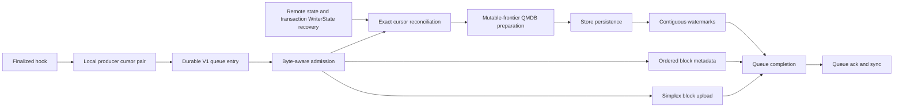
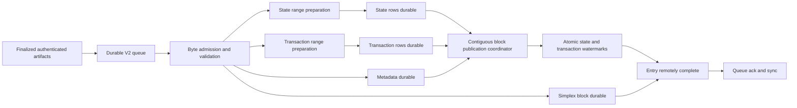

# Indexer Durable Queue Redesign

| Item | State |
| --- | --- |
| Design status | Proposed target architecture |
| Current implementation | Cursor-driven durable queue, called V1 below |
| Target implementation | Authenticated absolute-range durable queue, called V2 below |
| Primary owners | Constantinople indexer and Exoware QMDB |

This document is the source of truth for the intended V2 architecture. The
decisions in this document are the current design. Items under
[Open questions](#open-questions) still need an explicit decision before
implementation.

## Decision

V2 replaces the cursor-driven queue of operations to append later with a queue
of self-contained authenticated QMDB ranges whose absolute locations are
already known.

The durable queue becomes the sole authority used to restart the publisher.
Remote publication becomes at-least-once delivery. Restart replays every
unacknowledged entry without first reconstructing mutable Exoware writer state.
Replaying an entry derives the same logical Store keys and values.

This is not a proposal to store a bare Merkle proof. Each QMDB range must carry
the exact encoded operations, absolute bounds, authenticated prefix frontier,
and consensus-trusted result. Exoware must gain a stateless preparation API
that validates this artifact and deterministically creates the physical QMDB
rows.

Operations may be prepared and persisted out of order. Published watermarks
must still advance only across a contiguous durable prefix.

## Motivation

V1 solved two important production problems that remain part of V2.

- The durable queue captures finalized index material before the local QMDB can
  prune it.
- Byte-aware admission keeps an on-disk backlog from expanding into an
  unbounded number of in-memory upload representations.
- Queue acknowledgement waits for QMDB publication and digest-addressed
  Simplex block persistence.

V1 still has two restart authorities.

- The local queue owns the unpublished workload.
- Remote Exoware watermarks and `WriterState` own the Merkle continuation
  frontier.

The publisher must reconstruct state and transaction `WriterState` values from
Store, then reconcile both with one local queue entry. A production restart
demonstrated that the two remote recoveries can observe different Store views.
The resulting mixed cursor pair cannot be reconciled with the local queue and
causes `WriterOutOfSync` failures even when the underlying QMDB data is not
corrupt.

V2 removes that reconciliation boundary. Absolute authenticated ranges contain
everything needed to recreate their remote rows. Mutable remote writer state is
no longer required input for restart or preparation.

## Goals

- Make the local durable queue the publisher's only restart authority.
- Make every remote write safe to repeat after an ambiguous result or crash.
- Remove producer cursor metadata and remote `WriterState` recovery from the V2
  steady-state path.
- Allow independent QMDB range verification and preparation.
- Allow Store persistence to overlap without publishing across a gap.
- Preserve bounded memory and disk-backed backpressure.
- Preserve the pre-prune durability boundary.
- Preserve ordered `block_meta` publication.
- Acknowledge a queue entry only after every required destination is durable.
- Detect malformed or contradictory artifacts before staging remote writes.
- Make queue and row encodings safe across binary upgrades.

## Non-goals

- V2 does not remove QMDB operation locations. It makes them immutable entry
  data instead of mutable writer state.
- V2 does not eliminate QMDB row construction. Exoware must still create
  operation, update, presence, Merkle node, and watermark rows.
- V2 does not make watermarks unordered.
- V2 does not by itself give the explorer a fixed finalization-to-display
  latency. Metadata and QMDB still share a globally ordered Store stream.
- V2 does not solve a stall before the application finalized hook runs.
- V2 does not recover acknowledged history after remote Store data loss. The
  queue is a publication journal, not a permanent backup of pruned entries.
- V2 does not support multiple publishers for one QMDB namespace.
- V2 does not migrate an existing V1 queue, uploader, or Store namespace. It is
  enabled only on fresh networks.

## V1 architecture

The current queue payload contains:

- The finalized block.
- The local finalization timestamp.
- The next state QMDB operation location to capture.
- The next transaction QMDB operation location to capture.
- The state operations that may become unavailable after pruning.

Transaction operations, SQL rows, Exoware QMDB rows, and watermarks are derived
after queue admission. The queue stores state operations but discards the
historical proof used to retrieve them.



V1 already has useful foundations that V2 keeps.

- Disk entries remain raw bytes until byte admission succeeds.
- Admission charges encoded size at an amplification factor.
- One oversized entry acquires the whole budget and runs alone.
- The non-cloneable reservation remains alive through remote persistence,
  queue acknowledgement, and queue sync.
- The consumer keeps polling completed tasks while the queue head waits for
  capacity.
- `block_meta` persists in queue order before the matching QMDB watermark can
  become visible.
- State and transaction Store commits can overlap, while watermark publication
  follows a contiguous prefix.

The Rust ownership pattern behind the memory bound is RAII. Each active task
owns one `UploadReservation`. Dropping the reservation releases its semaphore
capacity on success, cancellation, or panic. V2 should preserve that single
owner rather than manually balancing acquire and release calls.

## V2 queue entry

The wire type will be versioned. The following structs are conceptual. They do
not prescribe final Rust names.

```rust
struct DurableIndexEntryV2<D> {
    format_version: u16,
    row_layout_version: u16,
    height: u64,
    block: Bytes,
    finalized_at_micros: i64,
    state: AuthenticatedRange<D>,
    transactions: AuthenticatedRange<D>,
    metadata: CanonicalMetadataRows,
}

struct AuthenticatedRange<D> {
    kind: QmdbKind,
    merkle_family_version: u16,
    hasher_id: u16,
    start: u64,
    end: u64,
    proof_target_end: u64,
    operation_root: D,
    operation_root_witness: Option<Bytes>,
    proof: Bytes,
    pinned_nodes: Vec<D>,
    encoded_operations: Vec<Bytes>,
    operation_codec_version: u16,
}
```

Ranges use half-open bounds `[start, end)`. The corresponding inclusive QMDB
location is `end - 1`. Each artifact authenticates the operations introduced
by one block against that block's result, so `proof_target_end` must equal
`end`.

The exact encoded operation bytes are canonical. Proof verification, Merkle
leaf hashing, operation rows, and replay all use those bytes. Typed operations
may be decoded to derive update rows and validate the terminal `Commit` or
`CommitFloor`, but re-encoding must equal the original bytes.

`operation_root` authenticates the encoded operations and pinned nodes. It is
not independently trusted. The validator must either match it directly to the
root in the finalized block header or verify `operation_root_witness` from it
to that header root. A proof that is internally consistent with an untrusted
embedded root is insufficient.

`CanonicalMetadataRows` contains the versioned logical metadata that the entry
must publish. It includes the `block_meta` fast-lane row and the bulk SQL rows.
The final representation may store encoded logical rows or the canonical inputs
for a frozen versioned encoder. It must not silently adopt the current binary's
latest schema while replaying an older entry.

The entry continues to carry the full block needed for digest-addressed Simplex
storage. Simplex certificate artifacts remain owned by the separate consensus
activity path.

## Finalized artifact handoff

The finalized handoff must provide the exact operation range introduced by the
block. Block header range starts cannot be used for this purpose. They describe
the retained range from an inactivity floor, not the base of the block's new
operations.

The preferred handoff exposes the merkleized batch base and authenticated range
material that execution already computed. Finalization should seal and enqueue
an existing artifact rather than regenerate a large proof on its latency path.

The account-state QMDB can currently provide historical operations, a range
proof, and pinned nodes before pruning. The transaction QMDB is compact and
discards historical operations. A complete V2 handoff therefore needs to
capture the transaction operations and proof material during execution or pass
the merkleized transaction batch to finalization.

The finalized hook must not return until the V2 entry is durable. Once it
returns, local pruning may discard everything not retained in the entry.

V2 removes the separate finalized cursor metadata partition. The operation
bounds in each entry come from the finalized artifact itself, not from the end
of the previous queued entry.

## Artifact validation

The consumer validates an admitted entry before producing any Store rows.

For each QMDB range it must verify:

1. The entry, row layout, operation codec, Merkle family, and hasher versions
   are supported.
2. `start < end` and checked range arithmetic succeeds.
3. `start + encoded_operations.len() == end`.
4. The proof target equals `end` and is structurally consistent with the
   proof's leaf count.
5. The exact operation bytes and every pinned node verify against the embedded
   operation root.
6. The embedded operation root or its witness resolves to the trusted root from
   the finalized block header.
7. Extending the pinned prefix with the exact operations produces the expected
   size and root.
8. The last state operation is a valid `CommitFloor` and the last transaction
   operation is a valid `Commit`.
9. The inactivity information derived from the terminal operation is
   consistent with the proof.
10. The state artifact is assigned to the state namespace and the transaction
    artifact is assigned to the transaction namespace.

Exoware's existing `OperationRangeCheckpoint` is close to the desired artifact,
but its current `verify` method is not the complete V2 validator. It authenticates
operations and pins against the root inside the checkpoint. It does not bind the
checkpoint watermark or verify the optional operation-root witness. V2 must
perform the full structural and trusted-root checks above.

A validation failure is deterministic corruption or an unsupported format. It
is not a transient Store error. The supervised indexer must fail without
acknowledging the queue entry.

## Exoware absolute-range API

V2 requires a stateless proof-aware preparation API. A conceptual shape is:

```rust
fn prepare_authenticated_range(
    range: VersionedAuthenticatedRange,
    expected_root: Digest,
    strategy: &impl Strategy,
) -> Result<PreparedAbsoluteRange, QmdbError>;
```

The API contract is:

- It does not read or mutate `WriterState`.
- It does not allocate a process-local dispatch ID.
- It does not inspect pending acknowledgements.
- It does not choose a publication watermark.
- It validates the complete artifact against the caller-trusted root.
- It extends Merkle state from the authenticated pinned prefix.
- It preserves proof-carried operation bytes for leaf hashing and operation
  rows.
- It emits logical Store keys without applying a namespace prefix.
- It emits rows in one documented canonical order.
- It returns the absolute start, exclusive end, latest location, operation
  counts, computed root, and deterministic rows.
- The same input produces byte-identical output under sequential and parallel
  hashing strategies.

The current pure row builders can be refactored into this API. The current
`WriterCore::prepare_upload` path cannot be reused unchanged because it assigns
locations from mutable `next_location`, serializes builds through `build_gate`,
and chooses watermarks from live dispatch state.

Preparation output must not contain schedule-dependent state such as dispatch
IDs, Store sequence numbers, or a selected watermark.

## Persistence and publication

Range preparation and data persistence may happen independently. Publication
remains coordinated.



Each QMDB data upload contains its operation, update, Merkle node, and end
presence rows. The presence row identifies one complete batch boundary. It does
not make that range queryable and does not prove earlier ranges are present.

### Watermark representation

A QMDB watermark is an append-only Store row inside one QMDB namespace. Its
logical key is the reserved family byte `0x03` followed by the inclusive QMDB
location encoded as a big-endian `u64`. Its value is empty. Big-endian encoding
makes lexicographic key order match numeric location order, so a reverse prefix
scan returns the greatest published location.

The state and transaction QMDBs have separate namespace prefixes and therefore
separate watermark keyspaces. The joint block barrier is not one shared scalar
watermark. It is a pair of rows:

- State watermark at `state.end - 1`.
- Transaction watermark at `transactions.end - 1`.

Both rows are staged in one atomic Store request. The Store sequence returned
by that request is the shared publication receipt. Older watermark rows remain
in Store. Publishing a later row advances the frontier because readers select
the greatest key.

The publication coordinator tracks durable half-open ranges by queue position
and absolute bounds. It rejects overlaps, contradictory duplicates, and gaps.
It may learn about later durable ranges first, but it advances only through the
first complete contiguous prefix.

The publication barrier is a small atomic Store batch containing the state and
transaction watermark rows for the highest block that is complete in both QMDB
instances. This keeps the two reader surfaces aligned at block boundaries
without forcing their expensive data preparation to run serially.

### Advancement algorithm

For each queue entry, the coordinator records its block height, state and
transaction bounds, and four readiness conditions. The required conditions are
state rows durable, transaction rows durable, ordered `block_meta` durable, and
bulk SQL durable. The final presence row is part of QMDB data durability.

Starting immediately after the last locally published queue position, the
coordinator scans entries in queue order. It stops at the first entry that is
not ready, whose start does not equal the preceding end in either QMDB, or
whose bounds contradict an already recorded range. A ready entry after that
gap remains durable but unpublished.

When one or more entries form a newly complete prefix, the coordinator takes
the final entry in that prefix and performs one atomic Store request containing
its two inclusive watermark rows. One request may therefore publish several
blocks at once. Intermediate watermark rows are unnecessary because the final
pair authorizes the complete prefix through both final locations.

Only after Store acknowledges that request does the coordinator advance its
local published position and resolve QMDB completion for every entry covered by
the pair. A failed or ambiguous request repeats the same two keys and empty
values. Repeating an older row cannot lower the visible frontier because
readers continue to select the greatest watermark key.

Simplex block persistence is not a prerequisite for watermark advancement.
It remains a separate queue-completion gate. This allows QMDB and SQL
publication to proceed while the Simplex upload finishes, but the local queue
entry cannot be acknowledged until both paths complete.

`block_meta` remains an ordered fast lane. Bulk SQL rows must be durable before
the publication barrier covers their block. This preserves the current
metadata-before-watermark contract and avoids exposing proofs for a block whose
index metadata is incomplete.

The fast lane is intentionally provisional. A `block_meta` row may become
visible before that block's bulk SQL rows, and later bulk SQL rows may become
visible before earlier ones. V2 does not promise atomic SQL visibility or
strict height ordering for detail rows. The joint state and transaction
watermark barrier is the publisher's block-completeness fence. A reader that
requires a fully indexed block must confirm that both of the block's exclusive
range ends are covered by the joint barrier and must read at or after the
barrier's Store sequence. The current split read APIs cannot perform both
checks as one operation. V2 metadata must bind the block to both ends. It may
store those ends directly or bind the block digest to a certified header that
contains them. SQL-only endpoints that cannot apply the fence remain
eventually consistent and must not present the fast-lane row as proof of full
indexing.

Data rows may be split into deterministic Store requests when one range is too
large for the preferred request size. Chunks persist in a fixed order. The
presence row is staged only in the final request after every earlier request is
durable. No watermark may be published until the final request succeeds. V2
must not reintroduce client-side batching across finalized blocks. Store
sequencing and kv-mk1 ingest workers own backend batching.

The Store sequence that contains the watermark rows is the publication receipt.
It is useful for telemetry and query read floors. It is not required to rebuild
publisher state after restart.

### Downstream visibility

QMDB readers treat a watermark as authorization for the entire contiguous
operation prefix from location zero through that inclusive location. Persisted
rows above the watermark are implementation detail and must not be returned as
published data.

Point, range, root, and proof requests at a requested watermark first verify
that the watermark has been published. A request above the latest published
location fails with a watermark-too-low error. The absence of every watermark
row is distinct from a published watermark at location zero.

QMDB subscriptions may observe operation and presence rows before the matching
watermark frame. They buffer those batches. A batch becomes eligible for
delivery only after a watermark at or above its end location arrives. Proof
construction then uses a Store read floor at least as high as both the data
batch sequence and watermark publication sequence.

The Constantinople QMDB service exposes operation-log proofs and subscriptions
for account state under `/state` and transactions under `/transactions`. A
unary operation-proof request supplies an explicit inclusive tip. The service
does not currently provide a latest-watermark request mode. A request whose tip
is ahead of the query replica's visible watermark fails and must be retried in
a new request session.

SQL and Simplex readers are not automatically fenced by QMDB watermarks.
`block_meta` may advertise a finalized block before its detail rows become
visible. Simplex may also expose its digest-addressed block on its independent
path.

The current explorer uses proof-directed eventual consistency. It obtains the
state and transaction roots and exclusive ends from a certified Simplex
header, obtains proof coordinates from SQL, and requests each QMDB proof at the
corresponding inclusive tip. Missing SQL rows and watermark-too-low errors are
retryable catch-up states. A proof or root mismatch is fatal.

The atomic pair prevents the publisher from intentionally exposing one QMDB for
a block without the other. It does not make separate downstream RPC sessions
an exact cross-service snapshot. A Store sequence floor is a lower visibility
bound, not an upper snapshot bound. Two unrelated sessions may still begin
before and after the barrier.

A consumer that requires a one-shot fully indexed result needs either one
server-side Store view spanning SQL and both QMDB namespaces or a consistency
token derived from the joint barrier sequence and accepted by every downstream
read path. The empty watermark values do not encode that sequence, and the
current split RPC services do not expose such a token.

## Completion contract

A V2 queue entry becomes complete only after:

- Ordered `block_meta` persistence.
- Bulk SQL row persistence.
- State QMDB data persistence.
- Transaction QMDB data persistence.
- State and transaction watermarks covering the entry.
- Digest-addressed Simplex block persistence.
- Durable queue acknowledgement and queue sync.

The upload reservation remains owned until acknowledgement and sync finish.
Simplex certificate persistence remains outside this queue contract because
certificates arrive through a different observer path.

If a completion channel closes or a deterministic worker exits, the supervised
indexer fails. It must not wait forever while retaining a reservation and
blocking the queue head.

## Restart behavior

V2 restart does not recover Exoware `WriterState` and does not use remote
watermarks to decide whether a queue entry should be skipped.

1. Open the V2 queue.
2. Replay every unacknowledged entry through byte admission.
3. Validate and prepare each absolute range independently.
4. Repeat the same logical Store writes.
5. Publish watermarks only through the contiguous locally completed prefix.
6. Acknowledge and sync entries after the full completion contract holds.

A crash after Store success but before queue acknowledgement repeats the same
keys and values. A repeated watermark row cannot lower the published frontier
because Exoware discovers the greatest watermark key.

Remote watermark reads may remain as diagnostics. They are not required input
for V2 progress.

The one-writer-per-namespace rule remains. Deterministic replay does not make
two independent publishers safe to race on publication policy.

## Backpressure

V2 keeps the current lazy queue codec and byte budget shape.

- One raw queue frame may exist outside admission.
- Structured decode, proof validation, range preparation, staged rows, request
  encoding, persistence waits, acknowledgement, and sync remain inside the
  reservation lifetime.
- One blocked queue head prevents later entries from bypassing it.
- An oversized entry runs alone.
- The count limit remains a secondary cap.
- The consumer continues reaping completed tasks while waiting for capacity.

Proofs, pins, and versioned metadata make V2 entries larger than V1 entries.
The current eight-times amplification charge is only an initial estimate. A
production-shaped heap profile must establish the V2 factor before rollout.

The queue is unbounded relative to memory, not relative to disk. Deployment
alerts must cover queue bytes, oldest entry age, disk free space, and projected
time to exhaustion.

## Encoding and upgrade policy

V2 uses its own queue partition with an explicit magic value and format
version. There is no V1 decoder, dual-read path, or in-place queue conversion.

Every entry records enough identity to freeze deterministic replay:

- Queue format version.
- QMDB backend kind.
- Merkle family and hasher identity.
- Operation codec version.
- Exoware row layout version.
- Metadata schema or encoder version.

Binaries that can open a V2 queue must retain the decoders and row encoders for
every unacknowledged version they claim to support. An unsupported version is a
startup error. It must not fall back to the latest encoder.

The initial implementation should store versioned canonical logical artifacts,
not fully prefixed physical Store keys. Exoware remains responsible for applying
the configured namespace prefix during staging. Persisting fully prepared rows
is a fallback only if golden tests cannot guarantee deterministic reconstruction
across supported upgrades.

`row_layout_version` identifies the encoder. It does not make incompatible row
layouts safe inside one QMDB namespace. A future incompatible layout requires a
new namespace and a separately designed network upgrade.

## Deployment model

V2 is a genesis-time choice for a new network. A network does not switch from
V1 to V2 in place.

- The V2 queue partition starts empty.
- The remote state and transaction QMDB namespaces start empty and have no
  watermark rows.
- The first queued artifact starts at location zero for both QMDBs and carries
  every genesis operation through its exclusive end.
- The V2 row layout may be designed without preserving byte parity with V1.
- Startup does not inspect V1 queue partitions, cursor metadata, writer state,
  or remote V1 namespaces.
- Existing V1 networks remain on their existing uploader unless a separate
  reindex design is approved later.

During initial network bootstrap, an unexpected pre-existing watermark or QMDB
row in a fresh-network namespace is a deployment error. The publisher must not
infer a continuation frontier from it.

## Failure handling

| Failure | V2 behavior |
| --- | --- |
| Invalid proof, bounds, root, or operation bytes | Fail the supervised indexer. Keep the entry unacknowledged. |
| Unsupported entry or row version | Refuse startup or fail before staging writes. |
| Transient Store failure | Retry or rebuild the same deterministic rows. |
| Ambiguous Store result | Repeat the same deterministic rows. |
| Later range finishes before an earlier range | Record durability. Do not advance the watermark across the gap. |
| Metadata worker stops | Fail publication before watermark advancement. |
| Simplex block worker stops | Fail the indexer. Keep the entry unacknowledged. |
| Queue ack or sync fails | Retry without releasing the reservation. |
| Remote namespace contains conflicting bytes for an absolute key | Treat as namespace corruption or multiple-writer violation. Do not repair by advancing the watermark. |

## Testing and acceptance

### Artifact tests

- Reject a checkpoint whose embedded root is not the finalized header root.
- Reject a checkpoint whose watermark does not match the proof leaf count.
- Reject wrong starts, ends, operation counts, pins, terminal commits, and
  namespace kinds.
- Prove that changing any operation byte fails validation.
- Prove that sequential and parallel hashing produce identical output.
- Prove that a V2 encoder can replay every supported historical format.

### Exoware parity tests

- Compare V2 absolute preparation with the existing deterministic row builders
  for the same operations from genesis and from nonzero starts.
- Cover state updates, deletes, floor movement, transaction appends, and commit
  operations.
- Compare every ordered logical key and value, Merkle node, presence row, root,
  and final size.
- Prepare adjacent ranges in reverse order and prove their outputs do not
  change.

### Publication tests

- Start with empty namespaces and prove that no watermark is observably
  different from a watermark at location zero.
- Persist range N plus 2 before N plus 1 and prove the watermark stops at N.
- Close the gap and prove one publication step can advance through every now
  contiguous range.
- Prove a publication step may omit intermediate watermark rows without
  withholding any operation in the newly authorized prefix.
- Prove both QMDB watermarks publish at the same block barrier.
- Prove the two watermark rows have the same Store publication sequence.
- Request an unpublished tip and observe a watermark-too-low error. Advance the
  barrier and prove a new request session succeeds.
- Prove subscriptions withhold persisted operation batches until a covering
  watermark arrives.
- Prove separate downstream sessions may observe different post-barrier tips
  even though the paired watermark rows were committed atomically.
- Prove metadata failure prevents watermark advancement.
- Prove queue acknowledgement waits for SQL, both QMDB instances, both
  watermarks, and Simplex block persistence.

### Crash matrix

Restart after each of these boundaries:

1. Before queue enqueue.
2. After queue enqueue and before artifact admission.
3. After metadata persistence.
4. After one QMDB range persists.
5. After both QMDB ranges persist and before watermark publication.
6. After watermark publication.
7. After Simplex block persistence.
8. After queue acknowledgement and before queue sync.
9. After queue sync.

Every restart must converge without remote writer recovery, missing SQL rows,
duplicate logical history, or publication across a gap.

### Production-shaped acceptance

- Restart with a multi-thousand-block backlog at the target transaction load.
- Fail the test if startup requires a QMDB Store read for writer recovery.
- Confirm that RSS plateaus at baseline plus the configured upload budget and
  the single raw-frame allowance.
- Confirm that the queue floor advances throughout catch-up.
- Confirm that proof preparation overlaps across blocks.
- Confirm that operation persistence can finish out of order while watermarks
  remain contiguous.
- Confirm that repeated ambiguous Store writes produce identical keys and
  values.
- Measure queue growth, proof size, preparation time, Store bytes, watermark
  lag, and replay count.

## Implementation plan

### Phase 0

Prototype the stateless Exoware builder for account state.

- Define the versioned authenticated range envelope.
- Validate exact bytes, bounds, pins, proof target, and trusted root.
- Reuse the existing deterministic row builders.
- Prove parity with the existing row builders and independent preparation.

### Phase 1

Define the finalized artifact handoff for both QMDB instances.

- Expose the exact merkleized batch base.
- Capture state proof material before prune.
- Capture transaction operations and proof material before compact history is
  discarded.
- Keep expensive proof work off the finalized-hook critical path where
  possible.

### Phase 2

Implement the V2 queue and publisher.

- Add the versioned queue partition and lazy decoder.
- Preserve byte admission and reservation ownership.
- Add independent range preparation and persistence.
- Add the block-level contiguous publication coordinator.
- Preserve metadata and Simplex completion gates.

### Phase 3

Bootstrap a fresh-network deployment and run the production-shaped fault
campaign.

- Exercise the full crash matrix.
- Validate memory and disk behavior under backlog.
- Confirm no steady-state V2 path reconstructs remote `WriterState`.
- Confirm the first artifacts start at location zero in both QMDBs.
- Refuse unexpected pre-existing QMDB rows or watermarks.

## Observability

V2 should expose:

- Queue entries, encoded bytes, oldest age, and acknowledgement floor.
- Disk free bytes and projected exhaustion time.
- Budget configured, reserved, waiting, and oversized-entry counts.
- Artifact construction and validation duration by QMDB kind.
- Proof, operation, pinned-node, and metadata bytes per entry.
- Preparation duration and generated row bytes per range.
- Store request bytes, row counts, attempts, ambiguous retries, and latency.
- Durable range gaps and highest prepared, persisted, and published ends.
- State and transaction watermark lag by block.
- Joint barrier Store sequence and the number of entries covered per
  advancement.
- Watermark-too-low responses and downstream catch-up retries.
- Metadata and Simplex completion latency.
- Replay count and entry format versions observed after restart.

## Open questions

### Finalized handoff API

The target artifact is settled. The exact handoff is not. We need to decide
whether Commonware passes merkleized batches to `Application::finalized`, or
Constantinople retains versioned artifacts from execution until their block
finalizes. The transaction compact QMDB makes this decision unavoidable.

### Metadata representation

The queue must replay metadata deterministically. We need to choose between
storing canonical encoded logical rows and storing inputs for a frozen
version-specific metadata encoder. Storing the latest Rust structs without an
encoder version is not acceptable. The selected V2 schema must also expose both
QMDB range ends or an equivalent identity for the block-completeness fence.

### Downstream completeness API

The current explorer can remain correct by retrying catch-up states and
verifying every proof against a certified header. We still need to decide
whether V2 should additionally expose a one-shot completeness endpoint or a
shared Store consistency token. The joint watermark Store sequence exists as a
publisher receipt, but it is not encoded in the watermark values or returned
by the current QMDB operation-log RPC.

### Store request chunking

The publication contract permits deterministic chunks within one range. The
initial maximum rows or bytes per request should be selected from kv-mk1
production measurements. Chunking must never place the presence row or
watermark before every preceding chunk is durable.

### Remote conflict audit

Steady-state replay does not require remote reads. We may still want a
background audit that samples already published absolute keys and reports a
same-key, different-value conflict. Such an audit must not become a hidden
restart dependency.

## Current source map

- [`src/publisher/qmdb.rs`](src/publisher/qmdb.rs) owns the V1 queue payload,
  cursor admission, metadata lane, QMDB preparation, Store commits, and
  watermark completion.
- [`../../bin/validator/src/run.rs`](../../bin/validator/src/run.rs) owns queue
  initialization, producer cursor persistence, byte admission, Simplex and
  QMDB completion, acknowledgement, and sync.
- [`src/publisher/certificate.rs`](src/publisher/certificate.rs) owns
  digest-addressed Simplex block persistence and certificate correlation.
- [`../application/src/consensus/glue.rs`](../application/src/consensus/glue.rs)
  invokes the finalized hook after database application.
- [`../application/src/consensus/db.rs`](../application/src/consensus/db.rs)
  defines the full state QMDB and compact transaction QMDB.
